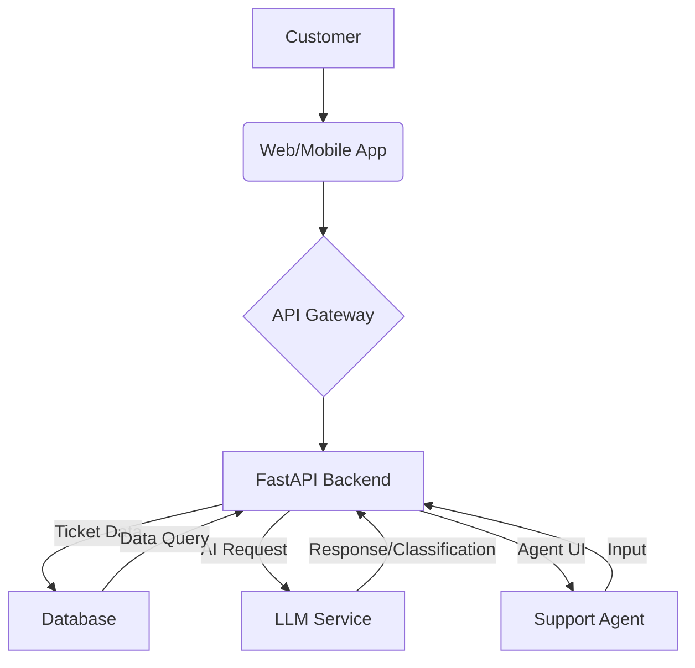
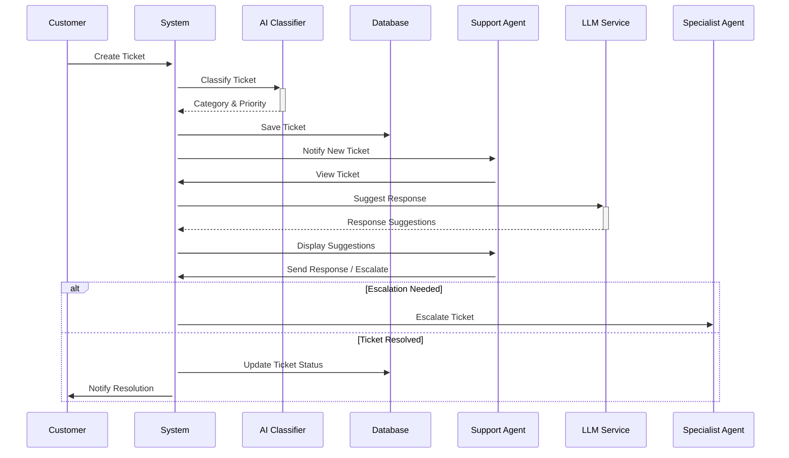
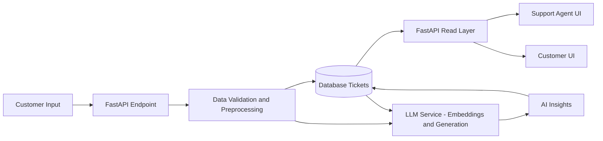

# Workflow Diagrams

## System Overview Diagram

This diagram provides a high-level overview of the entire customer support AI system, illustrating the main components and their interactions.

## Ticket Processing Workflow

This diagram details the lifecycle of a support ticket, from creation to resolution, highlighting the role of AI at each step.

## Data Flow Diagram

This diagram illustrates the flow of data within the system, showing where data originates, is processed, and stored.

